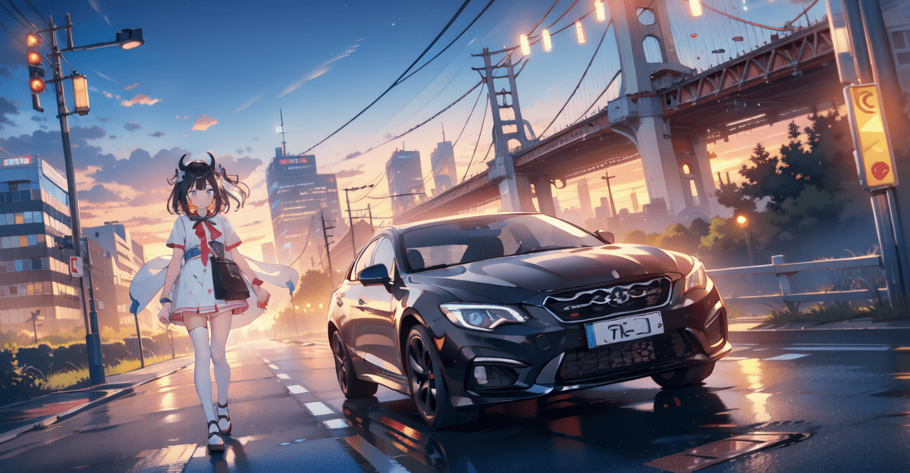

# 🚗 Jetson Nano - 車間距離推定 & ナンバープレート認識



## **📌 プロジェクト概要**
Jetson Nanoを使い、**カメラのみで車間距離を推定**し、**YOLOを使ってナンバープレートを高精度に認識**するシステムを構築します。

✅ **カメラを用いた車間距離推定**（YOLOで車両検出 → 距離推定）  
✅ **YOLO + OCR（Tesseract）でナンバープレート認識**（高精度）  
✅ **リアルタイムで車両の情報を表示**  
✅ **Jetson NanoのGPUを活用した高速処理**  

---

## **📌 1️⃣ 環境セットアップ**
### **🔧 依存パッケージのインストール**
```bash
sudo apt update
sudo apt install -y python3-opencv python3-pip wget tesseract-ocr
pip3 install numpy pytesseract
```

### **🔧 YOLOモデルのダウンロード**
```bash
wget -O yolov4-license-plate.weights https://some-pretrained-model-url.com
wget -O yolov4-license-plate.cfg https://some-config-url.com
```

---

## **📌 2️⃣ カメラで車間距離を推定**

🔧 **Pythonスクリプト `car_distance_estimation.py`**
```python
import cv2
import numpy as np

# YOLOv4の設定ファイルと学習済みモデルをロード
net = cv2.dnn.readNet("yolov4.weights", "yolov4.cfg")
layer_names = net.getUnconnectedOutLayersNames()
cap = cv2.VideoCapture(0)  # USBカメラ

def estimate_distance(box_area):
    if box_area == 0:
        return None
    return 5000 / box_area  # 仮の距離推定公式（調整可能）

while True:
    ret, frame = cap.read()
    if not ret:
        break
    height, width = frame.shape[:2]
    blob = cv2.dnn.blobFromImage(frame, 1/255.0, (416, 416), swapRB=True, crop=False)
    net.setInput(blob)
    detections = net.forward(layer_names)
    for detection in detections:
        for obj in detection:
            scores = obj[5:]
            class_id = np.argmax(scores)
            confidence = scores[class_id]
            if confidence > 0.5 and class_id == 2:
                box = obj[0:4] * np.array([width, height, width, height])
                (centerX, centerY, w, h) = box.astype("int")
                x = int(centerX - (w / 2))
                y = int(centerY - (h / 2))
                box_area = w * h
                distance = estimate_distance(box_area)
                cv2.rectangle(frame, (x, y), (x + w, y + h), (0, 255, 0), 2)
                cv2.putText(frame, f"Dist: {distance:.2f} m", (x, y - 10),
                            cv2.FONT_HERSHEY_SIMPLEX, 1, (0, 255, 0), 2)
    cv2.imshow("Car Distance Estimation", frame)
    if cv2.waitKey(1) & 0xFF == ord('q'):
        break
cap.release()
cv2.destroyAllWindows()
```
✅ **車のバウンディングボックスの面積から距離を推定！**  
✅ **リアルタイムで車間距離を表示！**  

---

## **📌 3️⃣ YOLOでナンバープレート認識**

🔧 **Pythonスクリプト `license_plate_recognition.py`**
```python
import cv2
import pytesseract
import numpy as np

# YOLOの設定
net = cv2.dnn.readNet("yolov4-license-plate.weights", "yolov4-license-plate.cfg")
layer_names = net.getUnconnectedOutLayersNames()
cap = cv2.VideoCapture(0)

while True:
    ret, frame = cap.read()
    if not ret:
        break
    height, width = frame.shape[:2]
    blob = cv2.dnn.blobFromImage(frame, 1/255.0, (416, 416), swapRB=True, crop=False)
    net.setInput(blob)
    detections = net.forward(layer_names)
    for detection in detections:
        for obj in detection:
            scores = obj[5:]
            class_id = np.argmax(scores)
            confidence = scores[class_id]
            if confidence > 0.5:
                box = obj[0:4] * np.array([width, height, width, height])
                (centerX, centerY, w, h) = box.astype("int")
                x = int(centerX - (w / 2))
                y = int(centerY - (h / 2))
                plate = frame[y:y+h, x:x+w]
                gray_plate = cv2.cvtColor(plate, cv2.COLOR_BGR2GRAY)
                plate_number = pytesseract.image_to_string(gray_plate, config="--psm 7")
                cv2.rectangle(frame, (x, y), (x + w, y + h), (0, 255, 0), 2)
                cv2.putText(frame, plate_number.strip(), (x, y - 10),
                            cv2.FONT_HERSHEY_SIMPLEX, 1, (0, 255, 0), 2)
    cv2.imshow("License Plate Recognition", frame)
    if cv2.waitKey(1) & 0xFF == ord('q'):
        break
cap.release()
cv2.destroyAllWindows()
```
✅ **YOLOでナンバープレートを高精度検出！**  
✅ **OCR（Tesseract）で番号を読み取り！**  

---

## **📌 4️⃣ まとめ**
✅ **カメラのみで車間距離を推定（YOLOで車両検出 → バウンディングボックスのサイズで距離を計算）**  
✅ **YOLOでナンバープレートを高精度に認識（OCRで番号を読み取る）**  


